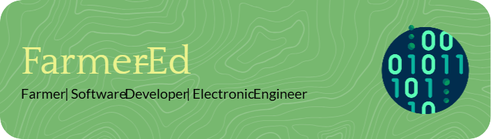

# About Me
I am a farmer, software developer and electronic engineer.   
In here you will find mostly agriculture and automation related Projects, but also some related to managing my daughters epilepsy. 

## Skills and Interests
- **Programming Languages:** JavaScript, C++, HTML, CSS, PHP, Python
- **Frameworks and Tools:** React, Node.js, Django, Docker, Node-Red
- **Interests:** Open-source farming, IoT in agriculture, Automation

## Agri Projects
- **[Farm-App](https://github.com/Farmer-Eds-Shed/farm-app):** Open-source front-end for farmOS.
- **[Farm Calendar Events](https://github.com/Farmer-Eds-Shed/farm_calendar_events):** Open-source Google calendar module for farmOS.
- **[Node-Red-4-farmOS ](https://github.com/Farmer-Eds-Shed/Node-Red-4-farmOS):** Node-Red Nodes and subflows for interacting with farmOS API.
- **[Silage Calculator](https://github.com/Farmer-Eds-Shed/Silage-Calculator):** A Simple silage calculator.
- **[Farm Weather Window](https://github.com/Farmer-Eds-Shed/Farm-Weather-Window):** Python Farm Weather App using OpenWeatherMap API.

## Epilepsy Projects
- **[Heart Rate Alarm](https://github.com/Farmer-Eds-Shed/Heart-Rate-Alarm):** Open-source Android alarm for naucturnal epeliptic seizures, works with fitness HRM monitors.
- **[Smart Medicine Bottle](https://github.com/Farmer-Eds-Shed/Smart-Medicine-Bottle):** Node-Red/RuuviTag Medicine Bottle sensor/reminder.
- **[NightWatch seizure alarm Node-Red API](https://github.com/Farmer-Eds-Shed/NightWatch-seizure-alarm-Node-Red-API):** Node-Red flows for interacting with NightWatch Seizure Alarm.

## Home Automation
- **[Home Assistant Heating Schedule](https://github.com/Farmer-Eds-Shed/Home-Assistant-Heating-Schedule):** Home Assitant YAML to create a user friendly heating schedule.
- **[Home Assistant Addon Repo](https://github.com/Farmer-Eds-Shed/Home-Assistant-Addon-Repo):** Ruuvi Go Gateway and NTFY addons for Home Assistant.
- **[Home Assistant Energy Monitoring](https://github.com/Farmer-Eds-Shed/Home-Assistant-Energy-Monitoring):** ESP32 energy monitor and HA YAML

## Misc API
- **[RuuviTag Hex Data Parser](https://github.com/Farmer-Eds-Shed/RuuviTag-Node-Red-Hex-Data-Parser):** Node-Red flow and JS to parse RuuviTag Hex Data.
- **[Node-Red Google API Flows](https://github.com/Farmer-Eds-Shed/Node-Red-Google-API-Flows):** Node-Red flows to handle Google API.
- **[Node-Red Toodledo API](https://github.com/Farmer-Eds-Shed/Toodledo-Node-Red-API):** Node-Red Oauth2 flow for ToodleDo.

## Everything Else
- **[All Repos](https://github.com/Farmer-Eds-Shed?tab=repositories)**

